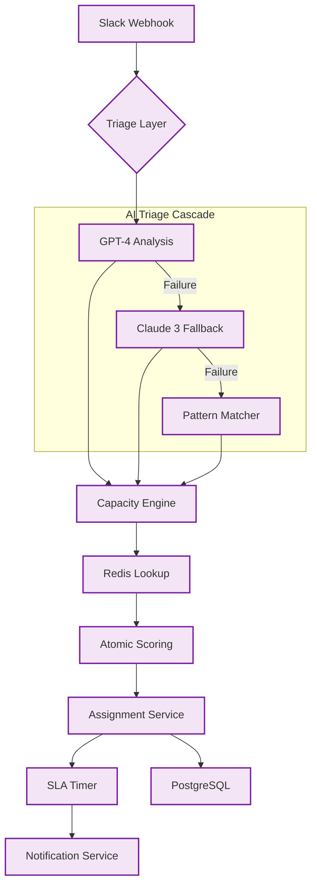

# 🏗️ Technical Architecture — flowdesk

## Components
- **AI Triage Cascade**: A resilient classification layer that attempts primary analysis with GPT-4, falling back to Claude and finally Regex to ensure 100% uptime.
- **Capacity Engine**: A Redis-backed service that calculates team load in real-time to prevent over-assignment.
- **SLA Watcher**: An active monitoring node that tracks task age and triggers escalations based on predefined lead notifications.

## Data Flow
1. **Intake**: A Slack webhook triggers the workflow upon a new message in designated channels.
2. **Classification**: The request is routed through the AI cascade to determine intent and priority.
3. **Scoring**: The system queries Redis for current member availability and capacity scores.
4. **Assignment**: The task is assigned to the best-fit team member and recorded in PostgreSQL.
5. **Monitoring**: The SLA timer begins tracking, triggering alerts if milestones are missed.

## Resilience & Compliance
- **Multi-Provider Redundancy**: The system is designed to survive API outages of individual AI providers.
- **Exponential Backoff**: All external API calls implement sophisticated retry logic to handle rate limits and transient errors.
- **Audit Trail**: Every state change is recorded in an append-only PostgreSQL table for complete transparency.

## Confidentiality
Note that specific workflow JSON exports, proprietary prompt engineering, and internal database schemas are withheld to protect client IP.
