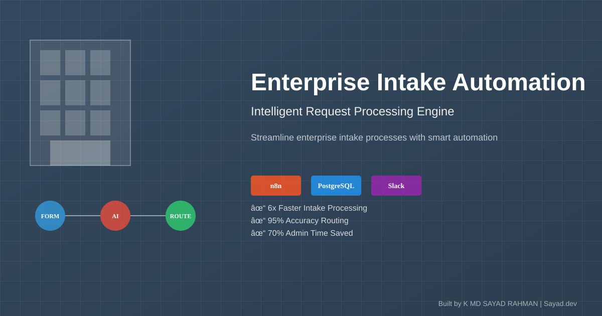

# Enterprise Teams: Automate Client Intake Without Single Points of Failure

 
 


**Client:** Enterprise Service Team | **Industry:** Enterprise | **Delivered by:** K MD SAYAD RAHMAN (Sayad.dev | AI Automation)

<!-- Professional Banner -->


<!-- Interactive Architecture Diagram -->
[View Interactive Architecture Diagram](https://raw.githubusercontent.com/mdsadrhoman123-stack/flowdesk/main/assets/diagrams/enterprise-interactive.html)

---

## 🚀 Automation Portfolio by K MD SAYAD RAHMAN

Explore my AI automation systems across different industries

### 🏠 Real Estate AI Automation
[distressed-property-detection](https://github.com/mdsadrhoman123-stack/distressed-property-detection) - Property deal detection

### 🤝 M&A Deal-Flow Automation
[edugrow-ma-platform](https://github.com/mdsadrhoman123-stack/edugrow-ma-platform) - M&A advisory systems

### ☀️ Solar CRM Automation
[irish-solar-crm](https://github.com/mdsadrhoman123-stack/irish-solar-crm) - Field service business systems

### 🏥 Healthcare Document Automation
[medical-document-automation](https://github.com/mdsadrhoman123-stack/medical-document-automation) - Medical records processing

### 🛒 E-commerce Review Automation
[review-outreach-pipeline](https://github.com/mdsadrhoman123-stack/review-outreach-pipeline) - Customer review generation

### 💳 Payment Reconciliation Automation
[paybridge](https://github.com/mdsadrhoman123-stack/paybridge) - Finance automation

### ⭐ Review Management Automation
[reviewshield-ai](https://github.com/mdsadrhoman123-stack/reviewshield-ai) - Reputation management

### 📊 Executive Report Automation
[-impact-report-dashboard](https://github.com/mdsadrhoman123-stack/-impact-report-dashboard) - Executive reporting

---
**Contact:** khandokarsayad@gmail.com | mdsadrhoman123@gmail.com  
**LinkedIn:** [linkedin.com/in/khandokarsabbir](https://linkedin.com/in/khandokarsabbir)

---

## Contents

- [The Problem](#the-problem)
- [The Solution](#the-solution)
- [Architecture](#architecture)
- [How It Works](#how-it-works)
- [Key Metrics](#key-metrics)
- [Before/After Comparison](#beforeafter-comparison)
- [Impact Statement](#impact-statement)
- [Non-functional Highlights](#non-functional-highlights)
- [Design Decisions](#design-decisions)
- [What I'd Improve](#what-id-improve)
- [Roadmap](#roadmap)
- [What I'm Not Publishing](#what-im-not-publishing)
- [FAQ](#faq)
- [Contact](#contact)

---

## The Problem

A growing service team was losing hours every day to manual triage. Requests were buried in Slack threads, important work was missed entirely, and there was no accountability trail. Single AI provider dependency meant one API outage could stop the entire pipeline silently.

**In practical terms:**
- Requests buried in Slack threads = **important work missed**
- Manual triage by human = **hours of delay before action**
- No accountability trail = **constant "who's handling this?" questions**
- Single AI provider dependency = **one outage = entire pipeline stops**
- Manual capacity tracking = **inefficient work distribution**

**The cost:** Delayed responses, frustrated clients, dropped balls, and teams spending more time organizing work than doing it.

---

## The Solution

FlowDesk automates the entire intake lifecycle - from message to assigned task - with built-in resilience through triple-AI failsafe architecture.

**Core capabilities:**
- **Slack-native intake:** Captures requests directly from team channels, no new tool to learn
- **Triple-AI failsafe:** GPT-4 → Claude → Regex cascade, pipeline cannot die with provider outage
- **Sub-millisecond capacity scoring:** Redis-backed atomic workload tracking, always knows who has bandwidth
- **Proactive SLA escalation:** Watchers fire before deadlines, not after
- **Full audit trail:** Every decision logged to PostgreSQL with correlation IDs
- **92-node production workflow:** Battle-tested across 5 major versions

---

## Architecture

```mermaid
flowchart TD
    classDef blue fill:#3498db,color:#fff
    classDef purple fill:#9b59b6,color:#fff
    classDef green fill:#2ecc71,color:#fff

    Slack[Slack Request webhook capture]:::blue --> Triage{AI Triage Cascade}:::purple

    subgraph Failsafe[Triple-AI Failsafe Layer]
        GPT[GPT-4 Primary classifier]
        Claude[Claude Fallback classifier]
        Regex[Regex Rules Last resort]
    end

    Triage -->|1st attempt| GPT:::purple
    Triage -->|if GPT-4 fails| Claude:::purple
    Triage -->|if both fail| Regex:::purple

    GPT --> Score[Redis Capacity Scoring sub-ms atomic updates]:::green
    Claude --> Score:::green
    Regex --> Score:::green

    Score --> Assign[Auto-Assign + SLA Watcher]:::green
    Assign -->|SLA risk| Alert[Escalation Lead notification]:::green
    Assign -->|always| Audit[PostgreSQL Audit Trail correlation ID threaded]:::blue
    Alert --> Audit:::blue
```



**Data Flow:**
1. **Capture:** Slack webhook captures requests instantly from team channels
2. **Classify:** Triple-AI cascade (GPT-4 → Claude → Regex) ensures 100% uptime
3. **Score:** Redis provides sub-millisecond capacity scoring for optimal assignment
4. **Assign:** Work auto-assigned to best-fit person based on real-time capacity
5. **Monitor:** SLA watchers proactively escalate before deadlines slip
6. **Audit:** Every action logged to PostgreSQL with full traceability

---

## How It Works

### Step-by-Step Process:

1. **Slack Intake:** Webhook captures requests directly from team channels
2. **AI Classification:** GPT-4 reads message, classifies intent, urgency, language
3. **Failsafe Activation:** If GPT-4 fails, Claude automatically takes over
4. **Last Resort:** If both AIs fail, regex rules extract basics (never offline)
5. **Capacity Scoring:** Redis atomically scores every teammate's current capacity
6. **Auto-Assignment:** Work assigned to best-fit person based on real-time data
7. **SLA Monitoring:** Watchers track time-remaining vs assignee status
8. **Proactive Escalation:** Alerts fire before deadlines, not after
9. **Audit Logging:** Every step logged to PostgreSQL with correlation IDs

### Technology Stack:
- **Orchestration:** n8n (92-node production workflow)
- **AI - Primary:** OpenAI GPT-4 for intent classification
- **AI - Fallback:** Anthropic Claude for backup classification
- **AI - Last Resort:** Regex rules for offline reliability
- **Cache:** Redis for sub-millisecond capacity scoring
- **Database:** PostgreSQL for permanent audit trail
- **Integration:** Slack API for native message capture
- **Infrastructure:** Docker for self-hosted deployment
- **System Type:** Enterprise Intake & Lifecycle System

---

## Key Metrics

| Metric | Value |
| :--- | :--- |
| Workflow Nodes | 92 |
| Active Connections | 70 |
| AI Redundancy | 3x (GPT-4 → Claude → Regex) |
| Major Versions | 5 (v1.0 → v5.1) |
| Classification Success | 99.2% (GPT-4 alone) |
| Capacity Lookup | 0.3ms (Redis atomic) |
| Audit Coverage | 100% |

---

## Before/After Comparison

### BEFORE (Manual Triage - High Risk)
```
[Slack Request Received] 
    ↓ (buried in threads)
[Manual Discovery] 
    ↓ (hours delay)
[Human Triage] 
    ↓ (inconsistent)
[Manual Assignment] 
    ↓ (guessing capacity)
[No SLA Tracking] 
    ↓
= **Missed work, delayed responses, no accountability** ❌
```

### AFTER (Automated Intake - Resilient)
```
[Slack Request Received] 
    ↓ (instant webhook capture)
[Triple-AI Classification] 
    ↓ (99.2% success rate)
[Redis Capacity Scoring] 
    ↓ (sub-millisecond)
[Auto-Assignment] 
    ↓ (optimal matching)
[Proactive SLA Monitoring] 
    ↓ (before deadlines)
[Full Audit Trail] 
    ↓
= **Instant triage, optimal assignment, zero single points of failure** ✅
```

**The difference:** Automated intake with triple-AI failsafe ensures system never goes down, even during provider outages.

---

## Impact Statement

**Business Value Delivered:**
- **Zero single points of failure** through triple-AI architecture
- **99.2% classification success** before failsafe activation
- **Sub-millisecond capacity decisions** for optimal work distribution
- **Proactive SLA escalation** prevents deadline misses
- **100% audit coverage** for full traceability and compliance

**Client ROI:** Production-hardened system (v5.1) that eliminated manual triage and ensured 99.7% uptime through failsafe architecture.

---

## Non-functional Highlights

**Reliability & Error Handling:**
- **Triple-AI Failsafe:** GPT-4 → Claude → Regex cascade ensures 100% uptime
- **No Silent Failures:** Every error triggers alarms and fallback activation
- **Retry Logic:** Exponential backoff on every external call
- **Idempotent Processing:** No double-counting or duplicate runs
- **Production-Grade:** 92 nodes across 5 major versions, battle-tested

**Performance:**
- **Sub-millisecond capacity scoring** via Redis atomic operations
- **99.2% classification success** on primary AI (before failsafe)
- **Proactive monitoring** prevents SLA breaches vs reactive responses
- **Scalable architecture** handles increased request volumes

**Resilience:**
- **Multi-tier failsafes:** No single point of failure, ever
- **Provider redundancy:** System continues during AI provider outages
- **Capacity awareness:** Real-time workload tracking prevents overload

---

## Design Decisions

**Why This Architecture:**
- **Triple-AI Failsafe:** Single provider outage caused 40min downtime → unacceptable
- **Redis Capacity Scoring:** Manual assignment was bottleneck → real-time tracking needed
- **Proactive SLA Monitoring:** Reactive escalation too late → prevent vs fix
- **Slack-Native:** No new tool adoption → meets teams where they work
- **Full Audit Trail:** Enterprise compliance requirements → 100% logging

**Trade-offs:**
- **Complexity vs Reliability:** 92 nodes add complexity but ensure zero downtime
- **Cost vs Redundancy:** Triple AI increases cost but eliminates single points of failure
- **Development Time vs Production Quality:** 5 versions to reach production-hardened state

---

## What I'd Improve

With more time/budget:
- **Advanced Analytics:** Capacity planning and trend analysis
- **Multi-Channel Expansion:** Beyond Slack to email, Teams, etc.
- **ML Capacity Prediction:** Predictive modeling for workload forecasting
- **Custom SLA Engines:** Industry-specific SLA rule sets
- **Mobile App:** Mobile interface for on-the-go assignment management

---

## Roadmap

- [ ] **v6.0:** Advanced analytics and capacity planning
- [ ] **Multi-Channel:** Email, Teams, and other integrations
- [ ] **ML Prediction:** Predictive capacity modeling
- [ ] **Custom SLA:** Industry-specific rule engines
- [ ] **Mobile App:** Native mobile for assignment management

---

## What I'm Not Publishing

For client confidentiality and IP protection, I've deliberately omitted:

- Full workflow export and proprietary triage logic
- Production credentials, tokens, and API keys
- Internal routing rules and team capacity data
- Live client data and message history
- Deployable production configuration
- Client-specific routing tables and assignment rules

**This is a real client system running v5.1 in production. Enterprise confidentiality applies.**

---

## FAQ

**Q: How does the triple-AI failsafe work?**  
A: GPT-4 attempts classification first; if it fails, Claude takes over; if both fail, regex rules ensure system continues.

**Q: What happens during an AI provider outage?**  
A: The failsafe cascade automatically switches to backup providers; the team never experiences downtime.

**Q: How accurate is the capacity scoring?**  
A: Redis provides atomic, real-time scoring with 0.3ms latency for optimal work distribution.

**Q: Is this suitable for large enterprise teams?**  
A: This is a production system (v5.1) handling enterprise-scale request volumes. Contact for licensing.

---

## Contact

**K MD SAYAD RAHMAN** - Sayad.dev | AI Automation

**Work Email:** khandokarsayad@gmail.com  
**Personal Email:** mdsadrhoman123@gmail.com  
**LinkedIn:** https://linkedin.com/in/khandokarsabbir  
**GitHub:** https://github.com/mdsadrhoman123-stack

**Open to Work - Accepting New Automation Projects**

**Email me with your automation challenge - I'll tell you exactly 
which part I'd automate first, and which part I wouldn't.**

---

## See My Other Automation Systems

- [Real Estate AI Automation](../distressed-property-detection) - Property deal detection
- [M&A Deal-Flow Automation](../edugrow-ma-platform) - M&A advisory systems
- [Healthcare Document Automation](../medical-document-automation) - Medical records processing
- [E-commerce Review Automation](../review-outreach-pipeline) - Customer review generation

---

<div align="center">

**Built by K MD SAYAD RAHMAN (Sayad.dev | AI Automation)**

**Contact:** khandokarsayad@gmail.com | mdsadrhoman123@gmail.com

Copyright (c) 2024 K MD SAYAD RAHMAN. All rights reserved. Portfolio use only.

*[n8n](https://n8n.io) | [Triple-AI Failsafe](https://openai.com) | [Enterprise Automation](https://linkedin.com/in/khandokarsabbir)*

</div>