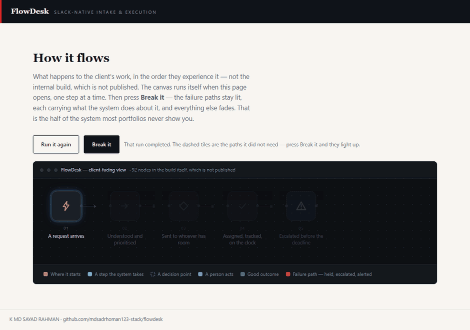
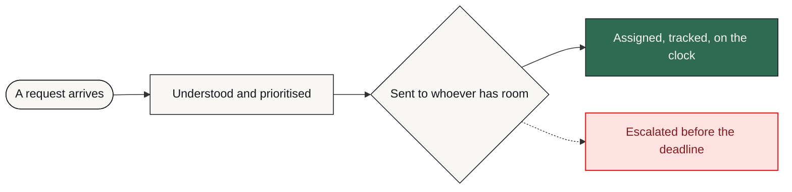

# FlowDesk

**Every request that lands in Slack gets classified, assigned to whoever actually has room, and escalated before the deadline rather than after it.**

     [](https://github.com/mdsadrhoman123-stack/flowdesk/actions/workflows/honesty-check.yml)



**The system in five seconds, then the same system failing on purpose.** The second half is the half most portfolios leave out. That is a recording of [`docs/index.html`](docs/index.html) in this repository — one file, no build step, no network — with the **Break it** button actually pressed, not illustrated.

> [!NOTE]
> **What this is.** A production-grade system built to a brief that businesses in this sector post publicly, in their own words — the problem exactly as they stated it, not one invented to demonstrate something. It was engineered the way anything a business actually depends on has to be: the failure paths designed before the features, every one of them logged and alerted rather than left to chance. It runs on my own infrastructure. It is ready to deploy for any business with this problem, and it has not been sold or deployed into a customer's business yet.

| | |
| :--- | :--- |
| **Built for** | Enterprise service teams |
| **The brief** | The problem exactly as businesses in this sector post it — public job briefs on Upwork and Fiverr, in their words, not my framing |
| **Industry** | Operations |
| **Status** | running on my own n8n |
| **Failure paths designed** | 8 — each with how it is detected, what the system does about it, and who finds out |
| **My role** | Sole engineer — scoping, architecture, build, failure design and operation |
| **Availability** | Ready to deploy for any business with this problem — built once as a product, not as a one-off. Running on my own infrastructure; not sold yet. |

---

### On this page

[The problem](#the-problem) · [What changed](#what-changed) · [How it works](#how-it-works) · [The shape of it](#the-shape-of-the-system) · [When it breaks](#when-it-breaks) · [Why this way](#why-it-is-built-this-way) · [Limitations](#honest-limitations) · [What is here](#what-is-in-this-repository) · [Read deeper](#read-deeper)

---

## The problem

A client message lands in Slack on a Friday afternoon. It gets a thumbs-up, scrolls out of view, and comes back on Monday as a complaint.

Nobody here is careless. Intake simply lives in people's habits instead of in a system, so urgency is guessed rather than assessed, work goes to whoever is online rather than whoever has capacity, and nothing is tracked until it is already late.

The real cost is not one dropped request. It is that nobody can tell you how many were dropped.

## What changed

| | Before | After |
| :--- | :--- | :--- |
| **Urgency** | Guessed by whoever reads it first | Classified on every request, same criteria |
| **Assignment** | Whoever is online | Live capacity score per teammate |
| **Tracking starts** | When someone remembers | At intake, automatically |
| **Escalation** | After the deadline | Before it, at a set threshold |
| **“Why here?”** | Nobody knows | The reasoning is in the audit row |

<sub>Before/after describes the change in process, not benchmarked throughput. Where a number is not measured, it is not claimed.</sub>

## How it works

Every incoming message passes through a triage step that classifies intent and urgency, then a Redis-backed workload engine scores live capacity per teammate and either assigns the work or escalates it — before a human has to look at it.

<table>
<tr>
<td width="42" valign="top" align="center"><b>01</b></td><td valign="top"><b>A request arrives</b><br>A teammate or client writes in Slack. Nothing new to learn, no form, no portal.</td>
</tr>
<tr>
<td width="42" valign="top" align="center"><b>02</b></td><td valign="top"><b>It gets read properly</b><br>Intent and urgency are extracted from the message as written, including in other languages.</td>
</tr>
<tr>
<td width="42" valign="top" align="center"><b>03</b></td><td valign="top"><b>It goes to the right person</b><br>Not the nearest person. The one whose live workload has room for it.</td>
</tr>
<tr>
<td width="42" valign="top" align="center"><b>04</b></td><td valign="top"><b>The clock starts itself</b><br>An SLA timer attaches at intake, not when someone remembers to start tracking.</td>
</tr>
<tr>
<td width="42" valign="top" align="center"><b>05</b></td><td valign="top"><b>It escalates early</b><br>At a set threshold the lead is told while there is still time to act.</td>
</tr>
<tr>
<td width="42" valign="top" align="center"><b>06</b></td><td valign="top"><b>The decision is on record</b><br>Assignment, escalation and priority changes are logged with the reasoning behind them.</td>
</tr>
</table>

### How it flows

<sub>What happens to the client's work, in the order they experience it. The internal build — node graph, execution order, prompts, thresholds — is deliberately not published.</sub>



<details>
<summary><b>What the shapes mean</b> — colour is not the only signal</summary>

| Shape | Means |
| :--- | :--- |
| **rounded** | Where the client's process starts |
| **box** | Something the system does |
| **diamond** | A decision point |
| **slanted** | A person has to act |
| **green box** | The good outcome |
| **red box** | Failure path — held, escalated or alerted |

Red appears in exactly one role across every repo in this portfolio: where failure goes. Nowhere else. If you see red, something is being held, escalated or alerted.
</details>

> **Walk it interactively** — [`docs/index.html`](docs/index.html) is a single self-contained page. Download it, open it in any browser, and press **Break it** to watch the failure path light up. Nothing to install, no network calls.

## The shape of the system

Parts and the role each one plays. Not the wiring — no execution order, no prompt text, no thresholds. That is a deliberate line, and the last branch of the tree names exactly what sits on the other side of it.

```text
FlowDesk — the running system
│
├── Interfaces ...................... the systems it talks to
│   └── Slack API ................... The team was already there — a new tool would have gone unused
│
├── Judgement ....................... where a decision or a piece of writing is made
│   ├── OpenAI GPT-4 ................ Primary classifier for intent and urgency
│   └── Anthropic Claude ............ Second provider, so one outage cannot take both tiers down
│
├── Memory .......................... what is remembered, and for how long
│   ├── Redis ....................... Capacity is read on every single request, so it has to be fast
│   └── PostgreSQL .................. Append-only audit history that survives a workflow re-import
│
├── Ground .......................... what the whole thing runs on
│   ├── n8n ......................... Self-hosted, so client conversations never leave their infrastructure
│   └── Docker ...................... Same stack on every client instance
│
├── Failure design .................. 8 paths, designed before the features
│   ├── detected by ................. an error output, a timer, or a failed connection
│   ├── handled by .................. falling back, holding, or halting — never guessing
│   └── announced to ................ a named person, with the reason attached
│
└── Not in this repository .......... the part that would let you skip the thinking
    ├── the node graph .............. which part runs after which, and on what condition
    ├── the prompts ................. wording, guardrails, the shape of the output
    ├── the thresholds .............. what counts as urgent, late, at capacity, a match
    └── the credentials ............. never committed, in any form, at any point
```

Read it as a set of decisions rather than a parts list. Every part is there because a specific failure or a specific constraint put it there, and the two sections below are the same story told twice: **When it breaks** is what each part is defending against, and **Honest limitations** is what it costs to have chosen that part and not another.

### Counted, not estimated

| | |
| :--- | :--- |
| Workflow nodes | **92** |
| Connections | **70** |
| Production versions | **5  (v1 → v5.1)** |
| AI failsafe tiers | **3** |

<sub>These are counts from the built system — nodes, stages, versions, gates. No efficiency percentages are published here without a stated measurement method.</sub>

### Also worth knowing

- Handles requests in multiple languages without a separate translation step.

## When it breaks

Most automation portfolios show you the happy path. The happy path is the easy half. This is the half that decides whether a system survives contact with a real business.

| What goes wrong | How it is detected | What the system does | Who finds out |
| :--- | :--- | :--- | :--- |
| **Primary model down or rate-limited** | Node error output | Claude takes over, then a regex tier | Alert names which tier served it |
| **Both providers unreachable** | Second failure in the chain | Regex classifies, flagged low-confidence | Lead alerted, request still moves |
| **Every teammate at capacity** | Redis capacity score | Queue and escalate to lead | Alert, not a silent queue |
| **Owner never acknowledges** | Acknowledgement timeout | Re-escalate rather than wait | Alert names both owners |
| **SLA nearing breach** | Timer threshold | Escalate while time remains | Alert states time left |
| **Slack API rejects a send** | Node error output | Retry with backoff, then queue | Alert with request context |
| **Redis unavailable** | Connection error | Fail closed — hold rather than guess capacity | Immediate alert |
| **Anything unanticipated** | Global error trigger | Halt that execution, keep state | Alert with execution ID |

The default on an unhandled condition is to **stop and tell someone** — never to continue on a guess. A silent success is the failure mode that costs the most, because nobody goes looking for it.

## Why it is built this way

Three decisions, each with the option that was turned down and the price of turning it down. A choice with no cost attached to it was not a choice — it was a default, and defaults are not worth reading about.

<details open>
<summary><b>Why capacity lives in Redis and not in the audit database</b></summary>

**What it does.** Capacity is read on every single request, so it sits in Redis where a read costs almost nothing. PostgreSQL holds the audit history, which is written once and read rarely — a completely different access pattern.

**What was turned down.** One store for both. Fewer moving parts and one less thing to keep alive, but then every capacity read competes with append-only audit writes on the same box, and the read is the one in the hot path.

**What that costs.** Two stores to operate. When Redis is unavailable the system fails closed — assignment is held rather than guessed at, so an outage delays work instead of misrouting it. That is the right way round, and it is still a delay.

</details>

<details>
<summary><b>Why there are two AI providers with a deterministic tier underneath</b></summary>

**What it does.** One provider classifies intent and urgency, a second provider sits behind it on the same contract, and a regex tier sits under both.

**What was turned down.** A single provider with a retry. Retrying is the obvious answer and it does not help at all in the case that matters: when the provider itself is the thing that is down, every retry fails the same way.

**What that costs.** Three paths that have to agree on the same output shape. The bottom tier reads urgency but not scope, so when both providers are unreachable the request keeps moving and a human should review it afterwards.

</details>

<details>
<summary><b>Why intake is Slack and not a form</b></summary>

**What it does.** Requests are taken where the team already talks, with nothing new to learn.

**What was turned down.** A ticket portal or an intake form. Cleaner, more structured data at the point of entry — and adoption is the entire problem being solved here. A tool nobody opens collects nothing, however good its schema is.

**What that costs.** One workspace per deployment. Multi-workspace is not a setting: it needs a tenant key on every capacity and audit write, not only at intake.

</details>

Every cost above also appears in **Honest limitations** below. It is there twice on purpose: once as the reasoning, once as the consequence, so neither can be quietly dropped from the other.

## Honest limitations

Every design decision costs something. These are the trade-offs in this build, stated by the person who made them.

- Capacity scoring counts open work, not difficulty. Two requests of the same count are not the same load, and a teammate on one hard task can read as available.
- Fails closed when Redis is unavailable, so an outage delays assignment rather than guessing wrong. Correct for this brief, but it is a trade — a durable queue in front of the capacity check would buffer instead of hold.
- Single Slack workspace. Multi-workspace would need a tenant key on every Redis and audit write, not only at intake.
- The regex tier classifies urgency, not scope. When both providers are down the request keeps moving, but a human should review it.

## What is in this repository

Every file, and the question it answers. Same layout in all eleven repositories in this portfolio, so the second one you open needs no orientation at all.

```text
flowdesk/
├── README.md ....................... ← you are here
├── SECURITY.md ..................... how to report something that should not be public
├── NOTICE.md ....................... what is withheld, and why
├── LICENSE ......................... covers the documentation, not a software grant
│
├── docs/ ........................... the long form — read in order or not at all
│   ├── index.html .................. the interactive demo, one file, no network
│   ├── 01-problem.md ............... the situation before, in full
│   ├── 02-journey.md ............... step by step, from their side
│   ├── 03-architecture.md .......... the diagrams, and why they are shaped that way
│   ├── 04-failure-handling.md ...... every failure path, and where it lands
│   ├── 05-stack.md ................. each choice, the option turned down, the cost
│   ├── 06-results.md ............... what is measured, and what is deliberately not
│   └── 07-limitations.md ........... the trade-offs, in detail
│
├── diagrams/ ....................... source, so the flow can be re-rendered
│   ├── pipeline-lr.mmd ............. the client-level flow, left to right
│   └── pipeline-tb.mmd ............. the same flow, top to bottom
│
├── assets/ ......................... local files only — nothing from a CDN
│   ├── banner.svg .................. the header on this page
│   ├── demo.gif .................... the recording at the top of this page
│   └── cta.svg ..................... the closing card
│
├── workflows/ ...................... empty on purpose — see below
│   └── README.md ................... why it is empty, in writing
│
└── .github/ ........................ the badge at the top of this page
    ├── honesty-check.py ............ the claim linter it runs
    └── workflows/
        └── honesty-check.yml ....... runs it on every push
```

There is no `src/` in that tree, and no `workflows/*.json`. That is not an omission — it is the design, and the next section says exactly what is being withheld and why.

## What is not in this repo

- **Data belonging to a real business.** None, in any form. Not anonymised, not sampled — there never was any.
- **Credentials and endpoints.** Never committed. See [`NOTICE.md`](NOTICE.md) for what is withheld, and [`SECURITY.md`](SECURITY.md) for how to report anything that slipped through.
- **The workflow itself.** No exports, no node graph, no execution order, no prompts, no scoring thresholds, no integration wiring — not sanitised, not partial, not in a screenshot. That is the build, and the build is not portfolio material.

This repository documents *how the problem was thought about* — the failure paths, the trade-offs, the reasoning. That is what tells you whether to hire someone. A copy of the wiring would not.

This is a portfolio repository documenting a system I designed and built. It is not a product you can clone and run against your own accounts.

## Read deeper

| | |
| :--- | :--- |
| [01 · The problem](docs/01-problem.md) | The situation before, in full |
| [02 · The journey](docs/02-journey.md) | Step by step, from their side |
| [03 · Architecture](docs/03-architecture.md) | Diagrams and the reasoning |
| [04 · Failure handling](docs/04-failure-handling.md) | Every path, and where it lands |
| [05 · The stack](docs/05-stack.md) | What was chosen and what was rejected |
| [06 · Results](docs/06-results.md) | What is measured and what is not |
| [07 · Limitations](docs/07-limitations.md) | The trade-offs, in detail |

---


### Tell me what the process is

I will tell you honestly whether automating it is worth your money — including when the answer is no.

**K MD SAYAD RAHMAN** — AI Automation Engineer  
n8n · AI agents · production reliability  
[khandokarsayad@gmail.com](mailto:khandokarsayad@gmail.com) · [mdsadrhoman123@gmail.com](mailto:mdsadrhoman123@gmail.com) · [LinkedIn](https://www.linkedin.com/in/khandokarsayad) · [More systems](https://github.com/mdsadrhoman123-stack)

