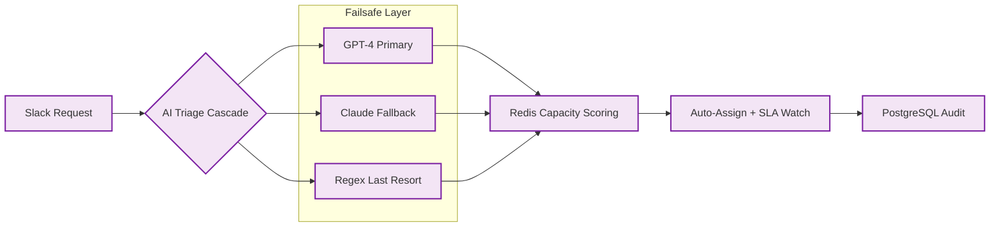

# ⚡ FlowDesk — Enterprise Intake & Lifecycle System
> AI-powered project intake engine — turns raw Slack requests into tracked, assigned work.

    

## The Problem
Growing service teams lose hours to manual triage, as requests often get buried in high-volume Slack threads. This leads to delayed response times and a lack of clear accountability for incoming tasks.

## The Solution
Flowdesk automates the entire intake lifecycle, from initial message to assigned task, using a multi-layered AI triage system. It ensures no request is missed while intelligently balancing team capacity in real-time.
- **Slack-native intake**: Captures requests directly from team channels.
- **Triple-AI failsafe**: Cascade logic ensuring classification never fails.
- **Real-time Capacity Scoring**: Sub-millisecond Redis-backed lookup.
- **Proactive SLA Watch**: Automated escalations and lead notifications.

## Architecture at a Glance

## Key Metrics
| Metric | Value |
| :--- | :--- |
| Workflow Nodes | 92 |
| Active Connections | 70 |
| Redundancy | 3× AI Cascade |

## What Was Built
- [x] Multi-layer failsafe cascade logic.
- [x] Redis-backed capacity scoring with atomic updates.
- [x] Proactive SLA escalation system.
- [x] Multi-language intent classification.
- [x] Exponential backoff and retry implementation across all nodes.

## Deliberately Not Published
- [ ] Full workflow export & proprietary triage logic (client confidentiality).
- [ ] Production credentials and API keys.
- [ ] Internal routing rules and sensitive team capacity data.

This repository is a portfolio presentation. No proprietary workflows, source code, or client data are published — by design.

## See It in Action

> Illustrative concept UI — a visual walkthrough of the workflow. Not a production screenshot.

## Tech Stack
- **Orchestration**: n8n
- **AI Models**: OpenAI GPT-4, Anthropic Claude
- **Data & Cache**: Redis, PostgreSQL
- **Integrations**: Slack API
- **Infrastructure**: Docker

[Architecture Deep-Dive](ARCHITECTURE.md) · [Case Study](CASE-STUDY.md)

---
Built by Sayad — AI Automation Engineer · Production-grade automation, not templates
