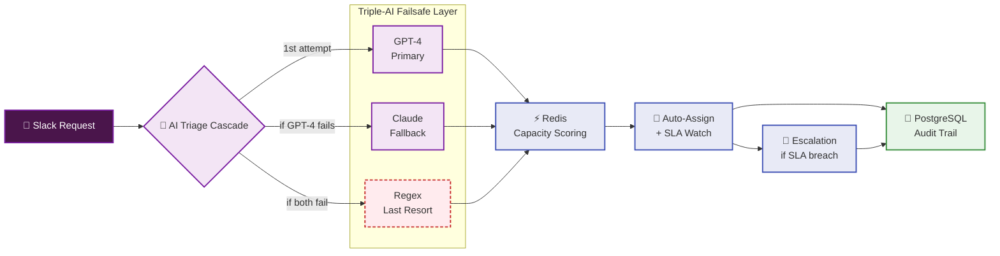
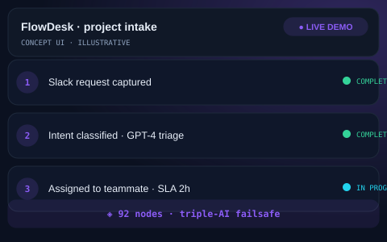

# ⚡ FlowDesk — Enterprise Intake & Lifecycle System

**AI-powered project intake engine — turns raw Slack requests into tracked, assigned work with a triple-AI failsafe.**

       

**92 nodes** · **70 active connections** · **5 major versions** · **3× AI redundancy**

---

## 📋 Table of Contents
- [The Problem](#-the-problem)
- [The Solution](#-the-solution)
- [Architecture & System Design](#-architecture--system-design)
- [How It Works — Step by Step](#-how-it-works--step-by-step)
- [What's Ready vs What's Not](#-whats-ready-vs-whats-not)
- [Concept Demo — See the Flow](#-concept-demo--see-the-flow)
- [Engineering Deep-Dive](#-engineering-deep-dive)
- [Tech Stack](#-tech-stack)
- [Confidentiality](#-confidentiality)

---

## 🔴 The Problem

> *"We lose hours every day just sorting Slack messages into tasks. Stuff gets buried. Nobody knows who owns what."*

Growing service teams face a daily bottleneck:

- **Messages drown in Slack threads** — important requests get pushed up by the next conversation, missed entirely.
- **Manual triage is slow** — a human reads every message, decides priority, assigns to a person. Hours pass before anything happens.
- **Zero accountability** — "who's handling this?" becomes the most-asked question. No trail, no SLA, no escalation.
- **One AI provider going down = everything stops** — if the single classifier fails, the whole pipeline grinds to a halt silently.

**The cost:** delayed response times, frustrated clients, dropped balls, and a team that spends more time organizing work than doing it.

---

## 🟢 The Solution

FlowDesk is an end-to-end **autonomous intake engine** that sits inside Slack and never sleeps:

- **Captures requests directly from Slack** — no new tool to learn, no manual data entry
- **Classifies intent, urgency, and language automatically** — using a triple-AI failsafe cascade
- **Scores team capacity in sub-milliseconds** — Redis-backed atomic workload tracking
- **Auto-assigns to the right person** — with proactive SLA escalation before deadlines slip
- **Logs every decision to PostgreSQL** — full audit trail, nothing happens in the dark

> The key insight: **a single AI provider is a single point of failure.** So FlowDesk uses three — GPT-4 first, Claude as fallback, regex as last resort. The pipeline literally cannot die with a provider outage.

---

## 🏗 Architecture & System Design

**Design principles:**
1. **No single point of failure** — every external dependency has a fallback
2. **Sub-millisecond decisions** — Redis for capacity, PostgreSQL for persistence
3. **Proactive, not reactive** — SLA watchers run *before* deadlines, not after
4. **Full traceability** — every action, every AI decision, every assignment is logged

---

## 📖 How It Works — Step by Step

| Step | What happens | Why it matters |
|:---:|---|---|
| 1️⃣ | A request lands in Slack — the webhook captures it instantly | **No polling, no missed messages.** The moment someone types, FlowDesk knows. |
| 2️⃣ | GPT-4 reads the message and classifies: intent, urgency, language | If GPT-4 is up, classification happens in ~2 seconds. This is the happy path. |
| 3️⃣ | If GPT-4 fails → Claude takes over automatically | **Provider outage? No problem.** Claude picks up where GPT-4 left off — the team never knows. |
| 4️⃣ | If Claude also fails → regex rules extract the basics | Even if every AI is down, the pipeline still moves. Regex is crude but **never offline**. |
| 5️⃣ | Redis scores every teammate's current capacity atomically | **Sub-millisecond lookup** — the system knows exactly who has bandwidth right now, not 10 minutes ago. |
| 6️⃣ | Work is auto-assigned to the best-fit person | No more "who should take this?" — the system decides with live data. |
| 7️⃣ | SLA watchers monitor time-remaining vs. assignee status | If a deadline is approaching and the assignee is heads-down, **escalation fires before the deadline, not after.** |
| 8️⃣ | Every step is logged to PostgreSQL with a correlation ID | Any action can be traced end-to-end. Month-end reporting becomes a query, not a hunt. |

---

## ✅ What's Ready vs What's Not

| ✅ Ready — Built & Delivered | ❌ Not Included — By Design |
|:---|:---|
| Multi-layer failsafe cascade (GPT-4 → Claude → Regex) | Full workflow export & proprietary triage logic |
| Redis-backed capacity scoring with atomic updates | Production credentials, tokens & API keys |
| Proactive SLA escalation with lead notifications | Internal routing rules & team capacity data |
| Multi-language intent classification | Live client data & message history |
| Exponential backoff + timeout on every external call | Deployable production config |
| 92-node production workflow (5 major versions) | Client-specific routing tables |

> **Production readiness: ~85%.** The architecture, failsafe logic, capacity scoring, SLA engine, and audit trail are production-hardened (v5.1, delivered to client). What's withheld is the **client-specific configuration** — routing rules, API credentials, and tenant data. Those are never publishable.

---

## 🎬 Concept Demo — See the Flow

> **Illustrative concept UI** — a visual walkthrough of how a Slack request flows through the system. Not a production screenshot. The real system processes hundreds of messages daily; this shows the journey of one.

---

## 🔧 Engineering Deep-Dive

<b>📐 Architecture Deep-Dive →</b>

The full technical breakdown — component-by-component, data flow, resilience patterns, and compliance notes — lives in [ARCHITECTURE.md](ARCHITECTURE.md).

<b>📊 Business Case Study →</b>

The story behind FlowDesk — the client's pain, the build journey, the impact, and engineering principles applied — lives in [CASE-STUDY.md](CASE-STUDY.md).

<b>🔄 Version History →</b>

| Version | What changed |
|:---:|---|
| v1.0 | Initial single-AI triage (GPT-4 only) |
| v2.0 | Added Claude as fallback provider |
| v3.0 | Added regex last-resort + exponential backoff |
| v4.0 | Redis capacity scoring + SLA escalation watchers |
| v5.0 | Multi-language support + full audit trail |
| v5.1 | Production hardening — timeout tuning, DLQ, idempotency |

---

## 🛠 Tech Stack

| Layer | Tool | Role |
|:---|:---|:---|
| Orchestration | **n8n** | 92-node workflow engine, scheduling, webhooks |
| AI — Primary | **OpenAI GPT-4** | Intent classification, urgency scoring, language detection |
| AI — Fallback | **Anthropic Claude** | Backup classifier when GPT-4 is unavailable |
| Cache | **Redis** | Sub-millisecond capacity scoring, atomic workload updates |
| Database | **PostgreSQL** | Permanent audit trail, assignment history, SLA tracking |
| Integration | **Slack API** | Native message capture, channel monitoring, notification delivery |
| Infrastructure | **Docker** | Self-hosted, full data control, no vendor lock-in |

---

## 🔒 Confidentiality

> This repository is a **portfolio presentation**. No proprietary workflows, source code, JSON exports, or client data are published — **by design**. The architecture and engineering decisions are shown openly; the implementation details remain confidential to protect client interests.

---

**Built by Sayad — AI Automation Engineer · Production-grade automation, not templates**

