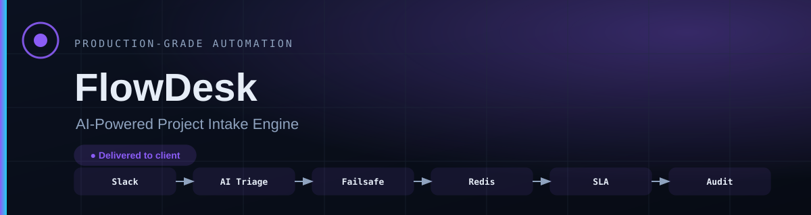

# FlowDesk

**Every request that lands in Slack gets classified, assigned to whoever actually has room, and escalated before the deadline rather than after it.**

   

| | |
| :--- | :--- |
| **Built for** | Enterprise service team |
| **Industry** | Operations |
| **Status** | production |
| **Role** | Designed, built and deployed end to end |

---

### On this page

[The problem](#the-problem) · [What changed](#what-changed) · [How it works](#how-it-works) · [When it breaks](#when-it-breaks) · [The stack](#the-stack) · [Limitations](#honest-limitations) · [Read deeper](#read-deeper)

---

## The problem

A client message lands in Slack on a Friday afternoon. It gets a thumbs-up, scrolls out of view, and comes back on Monday as a complaint.

Nobody here is careless. Intake simply lives in people's habits instead of in a system, so urgency is guessed rather than assessed, work goes to whoever is online rather than whoever has capacity, and nothing is tracked until it is already late.

The real cost is not one dropped request. It is that nobody can tell you how many were dropped.

## What changed

| | Before | After |
| :--- | :--- | :--- |
| **Urgency** | Guessed by whoever reads it first | Classified on every request, same criteria |
| **Assignment** | Whoever is online | Live capacity score per teammate |
| **Tracking starts** | When someone remembers | At intake, automatically |
| **Escalation** | After the deadline | Before it, at a set threshold |
| **“Why here?”** | Nobody knows | The reasoning is in the audit row |

Before/after describes the change in process, not benchmarked throughput. Where a number is not measured, it is not claimed.

## How it works

Every incoming message passes through a triage step that classifies intent and urgency, then a Redis-backed workload engine scores live capacity per teammate and either assigns the work or escalates it — before a human has to look at it.

<table>
<tr>
<td width="42" valign="top" align="center"><b>01</b></td><td valign="top"><b>A request arrives</b> A teammate or client writes in Slack. Nothing new to learn, no form, no portal.</td>
</tr>
<tr>
<td width="42" valign="top" align="center"><b>02</b></td><td valign="top"><b>It gets read properly</b> Intent and urgency are extracted from the message as written, including in other languages.</td>
</tr>
<tr>
<td width="42" valign="top" align="center"><b>03</b></td><td valign="top"><b>It goes to the right person</b> Not the nearest person. The one whose live workload has room for it.</td>
</tr>
<tr>
<td width="42" valign="top" align="center"><b>04</b></td><td valign="top"><b>The clock starts itself</b> An SLA timer attaches at intake, not when someone remembers to start tracking.</td>
</tr>
<tr>
<td width="42" valign="top" align="center"><b>05</b></td><td valign="top"><b>It escalates early</b> At a set threshold the lead is told while there is still time to act.</td>
</tr>
<tr>
<td width="42" valign="top" align="center"><b>06</b></td><td valign="top"><b>The decision is on record</b> Assignment, escalation and priority changes are logged with the reasoning behind them.</td>
</tr>
</table>

### How it flows

What happens to the client's work, in the order they experience it. The internal build — node graph, execution order, prompts, thresholds — is deliberately not published.

<b>What the shapes mean</b> — colour is not the only signal

| Shape | Means |
| :--- | :--- |
| **rounded** | Where the client's process starts |
| **box** | Something the system does |
| **diamond** | A decision point |
| **slanted** | A person has to act |
| **green box** | The good outcome |
| **red box** | Failure path — held, escalated or alerted |

Red appears in exactly one role across every repo in this portfolio: where failure goes. Nowhere else. If you see red, something is being held, escalated or alerted.

> **Walk it interactively** — [open the demo](https://mdsadrhoman123-stack.github.io/flowdesk/) and press **Break it** to watch the failure path light up. Source: [`docs/index.html`](docs/index.html)

## When it breaks

Most automation portfolios show you the happy path. The happy path is the easy half. This is the half that decides whether a system survives contact with a real business.

| What goes wrong | How it is detected | What the system does | Who finds out |
| :--- | :--- | :--- | :--- |
| **Primary model down or rate-limited** | Node error output | Claude takes over, then a regex tier | Alert names which tier served it |
| **Both providers unreachable** | Second failure in the chain | Regex classifies, flagged low-confidence | Lead alerted, request still moves |
| **Every teammate at capacity** | Redis capacity score | Queue and escalate to lead | Alert, not a silent queue |
| **Owner never acknowledges** | Acknowledgement timeout | Re-escalate rather than wait | Alert names both owners |
| **SLA nearing breach** | Timer threshold | Escalate while time remains | Alert states time left |
| **Slack API rejects a send** | Node error output | Retry with backoff, then queue | Alert with request context |
| **Redis unavailable** | Connection error | Fail closed — hold rather than guess capacity | Immediate alert |
| **Anything unanticipated** | Global error trigger | Halt that execution, keep state | Alert with execution ID |

The default on an unhandled condition is to **stop and tell someone** — never to continue on a guess. A silent success is the failure mode that costs the most, because nobody goes looking for it.

## The stack

| Component | Why this one |
| :--- | :--- |
| **n8n** | Self-hosted, so client conversations never leave their infrastructure |
| **Slack API** | The team was already there — a new tool would have gone unused |
| **Redis** | Capacity is read on every single request, so it has to be fast |
| **OpenAI GPT-4** | Primary classifier for intent and urgency |
| **Anthropic Claude** | Second provider, so one outage cannot take both tiers down |
| **PostgreSQL** | Append-only audit history that survives a workflow re-import |
| **Docker** | Same stack on every client instance |

### Counted, not estimated

| | |
| :--- | :--- |
| Workflow nodes | **92** |
| Connections | **70** |
| Production versions | **5  (v1 → v5.1)** |
| AI failsafe tiers | **3** |

These are counts from the built system — nodes, stages, versions, gates. No efficiency percentages are published here without a stated measurement method.

### Also worth knowing

- Handles requests in multiple languages without a separate translation step.

## Honest limitations

Every design decision costs something. These are the trade-offs in this build, stated by the person who made them.

- Capacity scoring counts open work, not difficulty. Two requests of the same count are not the same load, and a teammate on one hard task can read as available.
- Fails closed when Redis is unavailable, so an outage delays assignment rather than guessing wrong. Correct for this client, but it is a trade — a durable queue in front of the capacity check would buffer instead of hold.
- Single Slack workspace. Multi-workspace would need a tenant key on every Redis and audit write, not only at intake.
- The regex tier classifies urgency, not scope. When both providers are down the request keeps moving, but a human should review it.

## What is not in this repo

- **Client data.** None, in any form. Not anonymised, not sampled.
- **Credentials and endpoints.** Never committed. See [`NOTICE.md`](NOTICE.md).
- **The workflow itself.** No exports, no node graph, no execution order, no prompts, no scoring thresholds, no integration wiring — not sanitised, not partial, not in a screenshot. That is the build, and the build belongs to the engagement that paid for it.

This repository documents *how the problem was thought about* — the failure paths, the trade-offs, the reasoning. That is what tells you whether to hire someone. A copy of the wiring would not.

This is a portfolio repository documenting delivered work. It is not a product you can clone and run against your own accounts.

## Read deeper

| | |
| :--- | :--- |
| [01 · The problem](docs/01-problem.md) | The situation before, in full |
| [02 · The client journey](docs/02-journey.md) | Step by step, from their side |
| [03 · Architecture](docs/03-architecture.md) | Diagrams and the reasoning |
| [04 · Failure handling](docs/04-failure-handling.md) | Every path, and where it lands |
| [05 · The stack](docs/05-stack.md) | What was chosen and what was rejected |
| [06 · Results](docs/06-results.md) | What is measured and what is not |
| [07 · Limitations](docs/07-limitations.md) | The trade-offs, in detail |

---

### Tell me what the process is

I will tell you honestly whether automating it is worth your money — including when the answer is no.

**K MD SAYAD RAHMAN** — AI Automation Engineer  
n8n · AI agents · production reliability  
[khandokarsayad@gmail.com](mailto:khandokarsayad@gmail.com) · [mdsadrhoman123@gmail.com](mailto:mdsadrhoman123@gmail.com) · [LinkedIn](https://www.linkedin.com/in/khandokarsayad) · [More systems](https://github.com/mdsadrhoman123-stack)

